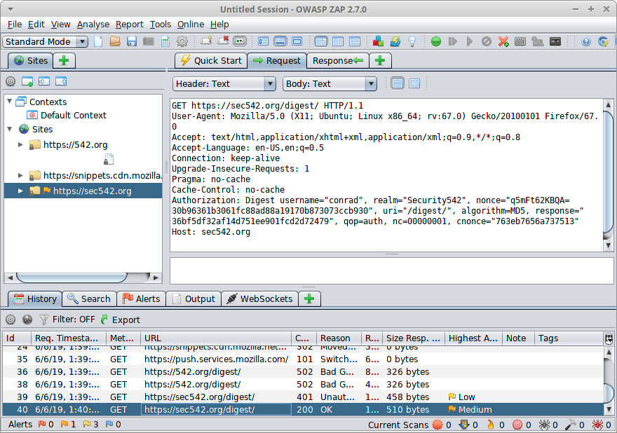

# digestive
Dictionary cracking tool for HTTP Digest challenge/response hashes

Code based on: https://gist.github.com/yesecurity/5fb47f44e289e8bc9c35
 * Thank you, yessecurity!
 * https://gist.github.com/yesecurity
 
Launches dictionary attack vs captured HTTP Digest credentials (taken from a PCAP, Burp or ZAP proxy, etc.)

## Example credential



```Authorization: Digest username="conrad", realm="Security542", nonce="q5mFt62KBQA=30b96361b3061fc88ad88a19170b873073ccb930", uri="/digest/", algorithm=MD5, response="36bf5df32af14d751ee901fcd2d72479", qop=auth, nc=00000001, cnonce="763eb7656a737513"```

## Resulting command line (using John the Ripper's wordlist)
 
```digestive --username conrad --wordlist /opt/john/run/password.lst --method GET --uri /digest/ --nc 00000001 --qop auth --realm Security542 --cnonce 763eb7656a737513  --nonce q5mFt62KBQA=30b96361b3061fc88ad88a19170b873073ccb930 --response 36bf5df32af14d751ee901fcd2d72479```
